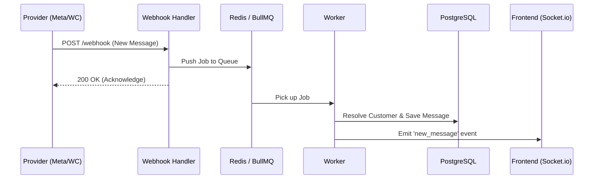

# MyAlice CRM Clone: Omnichannel Architecture

A high-performance, real-time omnichannel CRM clone designed for scalability and unified customer context.

## 🚀 Architecture Overview

This project uses an **Event-Driven, Micro-Workspace Architecture** to handle real-time messaging across multiple social and ecommerce channels.

### Key Pillars
1. **Universal Customer Profile (UCP):** Disparate identities (Email, WhatsApp ID, Meta PSID) are unified into a single customer entity.
2. **Unified Inbox:** A real-time message bus that aggregates data from all connected webhooks into a single stream.
3. **Webhook Hub:** Dedicated handlers that normalize incoming data from Meta Graph API, WhatsApp Cloud API, and WooCommerce into a standard internal event format.

## 🛠️ Project Structure

- `apps/web`: Next.js frontend with Tailwind CSS. Features the 3-column unified inbox.
- `apps/server`: Node.js/TypeScript backend. Manages business logic, RBAC, and Socket.io broadcasts.
- `workers/webhooks`: Lightweight consumers that process heavy webhook traffic using BullMQ/Redis to prevent blocking the main API.
- `packages/db`: Contains the PostgreSQL schema and interaction layer.

## 📡 Webhook Flow (Real-time Sync)



## 🏗️ Getting Started

### Prerequisites
- Node.js (v18+)
- PostgreSQL
- Redis

### Setup
1. Clone the repo.
2. Configure `.env` in `apps/server` with your Meta App credentials.
3. Apply the database schema:
   ```bash
   psql -d myalice_clone -f packages/db/schema.sql
   ```
4. Run the development environment:
   ```bash
   npm install
   npm run dev
   ```

## 🔐 Security
- API Keys are stored encrypted in the `channels` table.
- All webhook requests are signature-validated before processing.
